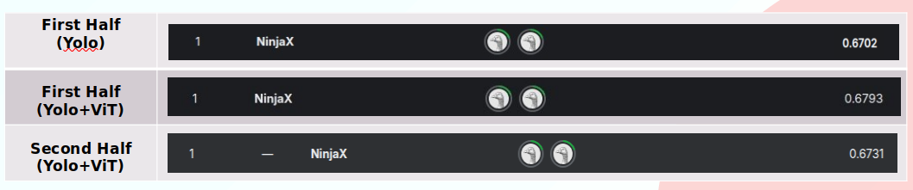
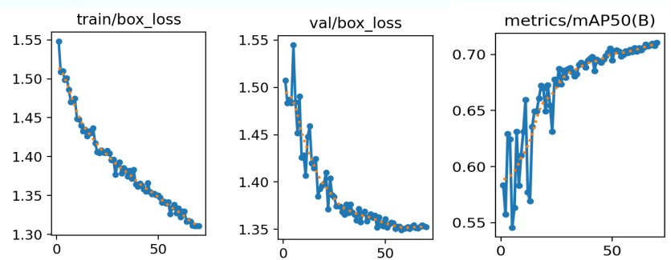
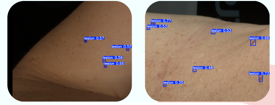

# iToBoS 2024 Detection (Kaggle) – Solution Repository

## Team
- [Solomon Chibuzo Nwafor](https://github.com/solonso)
- [Muhammad Faran Akram](https://github.com/mfa006)

## Competition
- iToBoS 2024 – Skin Lesion Detection with 3D-TBP
- Kaggle link: [https://www.kaggle.com/competitions/itobos-2024-detection](https://www.kaggle.com/competitions/itobos-2024-detection)
- NinjaX Result:



## Goal
- Detect skin lesions in high resolution skin patch images
- Output bounding boxes per image in the Kaggle submission format

## repo content
- Training and inference scripts for a YOLO based detector
- A second stage classifier filter (MedViT) to remove false positives
- Utilities for dataset preparation, split, and evaluation
- Example submissions produced by the pipeline

## Approach

### 1) Detector
- Ultralytics YOLO models (see `yolo_train.py`)
- Train on YOLO format labels
- Use a 1024 input size at inference (see `yolo_test2.py` and `test_models.py`)



### 2) Data preparation trick
- Blur non skin background to reduce background driven false positives
- Script: `preprocess.py`
- Output: `split_dataset_blurred` (configurable inside the script)

### 3) False positive reduction
- Run YOLO on each test image
- For each predicted box, crop an expanded patch and classify it with MedViT
- Keep the box if
  - YOLO confidence is high (hard keep), or
  - MedViT predicts lesion (keep), else drop
- Script: `test_models.py`



### 4) Submission formatting
- `prediction_string` stores repeated groups of 5 values
  ```
  x_min y_min x_max y_max class_id
  ```
- This repo uses `class_id = 0` (single class)
- Scripts producing the CSV
  - `yolo_test2.py` (YOLO only)
  - `test_models.py` (YOLO + MedViT filtering)

## Repository structure

```
iToBoS-main/
├── params.yaml
├── preprocess.py
├── split_data.py
├── yolo_train.py
├── yolo_test2.py
├── test_models.py
├── compute_map.py
├── utils.py
├── predictions/
│   ├── filtered_predictions_0.6792.csv
│   └── filtered_predictions_0.6793.csv
├── filtered_predictions1.csv
├── Lesion-Detection-Challange/ (git submodule)
└── MedViT/ (git submodule)
```

## Setup

### 1) Clone with submodules
```bash
git clone --recursive https://github.com/solonso/iToBoS.git
cd iToBoS
```

### 2) Install dependencies
- Python 3.9 or newer recommended
- Core packages used in this repo:
  - `ultralytics`
  - `torch`
  - `torchvision`
  - `opencv-python`
  - `numpy`
  - `pandas`
  - `pillow`
  - `tqdm`

### 3) Get the dataset
- Download from the Kaggle competition page
- Prepare folders to match the paths in `params.yaml` and the scripts
- Labels must be in YOLO format

## Configuration

### 1) params.yaml
- Set dataset paths (train, val, test)
- Set YOLO dataset yaml path (train_yaml)
- Set model list and training parameters if needed

### 2) Script level constants
These scripts use top of file constants, not CLI flags:
- `preprocess.py`
  - `SOURCE_DIR`, `DEST_DIR`, `BLUR_STRENGTH`
- `split_data.py`
  - reads `params.yaml`
- `yolo_train.py`
  - reads `params.yaml`
- `yolo_test2.py`
  - set model path and test dir inside the file
- `test_models.py`
  - YOLO weights path, MedViT checkpoint path, output dirs inside the file

## Reproduce the pipeline

### Step 1: Blur background (optional but used in our runs)
```bash
python preprocess.py
```

### Step 2: Create train val split and YOLO directory layout
```bash
python split_data.py
```

### Step 3: Train YOLO
```bash
python yolo_train.py
```

### Step 4: Generate a submission with YOLO only
```bash
python yolo_test2.py
```

### Step 5: Run YOLO + MedViT filter and write final submission
```bash
python test_models.py
```

## Outputs

### Submissions
- `predictions/filtered_predictions_0.6793.csv`
- `predictions/filtered_predictions_0.6792.csv`

### If you want quick sanity checks
- Each row is one `image_id`
- `prediction_string` is empty for images with no detections
- Each detection uses 5 values (`x_min y_min x_max y_max class_id`)

### Numbers from the example best submission file in this repo
- File: `predictions/filtered_predictions_0.6793.csv`
- Images in file: 8481
- Average boxes per image: 3.45
- Images with zero boxes: 1944 (22.9 percent)
- Best score label saved with the file name: 0.6793

## Credits and references
- Competition and dataset: [iToBoS 2024 (Kaggle)](https://www.kaggle.com/competitions/itobos-2024-detection)
- Official dataset tooling and format converters: [iToBoS Lesion Detection Challenge repository](https://github.com/iToBoS/Lesion-Detection-Challange)
- Dataset description and scale: ISIC archive DOI page for the iToBoS 2024 detection dataset
- Background context on the dataset: arXiv paper describing the iToBoS 3D-TBP derived skin region images
